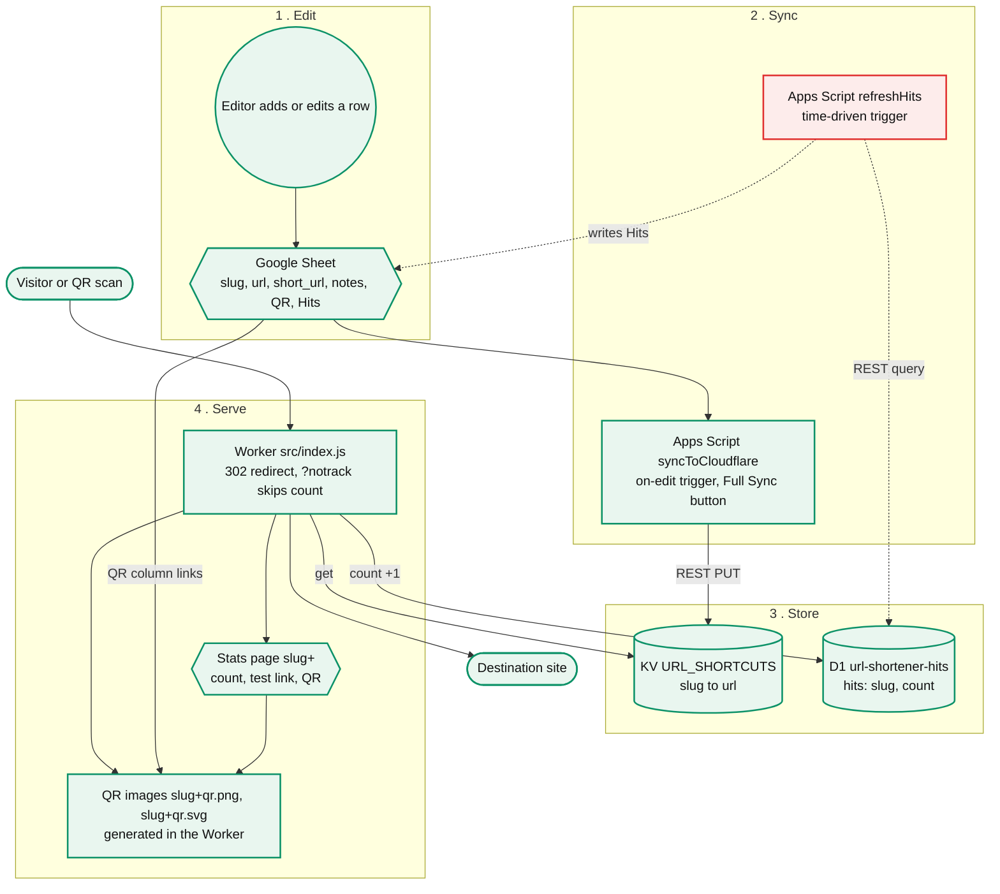

# Architecture

Shapes: stadium = outside world, rectangle = code that runs, cylinder = data store, hexagon = UI surface, circle = human step.

## Not built yet

| Piece | State | Evidence |
|---|---|---|
| `refreshHits` | In Apps Script, but the D1 query returns 403 (7403) | `appsscript/sync.gs`; token needs Account, D1, Read on the account in `CF_ACCOUNT_ID` |

The QR image routes are on `feature/worker-qr-png` and go live when it's merged.
